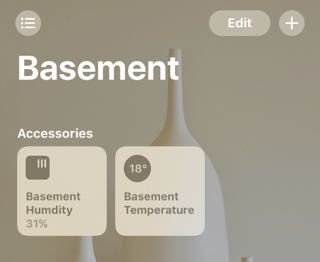

[](https://npmjs.org/package/homebridge-dht)

Supports integration of a DHT11/DHT21/DHT22/DHT33/DHT44 Temperature/Humidity Sensor into hombridge via the [BCM2835](http://www.airspayce.com/mikem/bcm2835/) library on a Raspberry PI.   I have tried numerous other interface methods for the DHT22, and found that this was least problematic.  Also includes optional reporting of the RaspBerry PI CPU Temperature.  This latest version splits the temperature and humidity into separate sensors, so they are readable from the home screen icon.  Historical display of temperature data is available via HomeKit apps thats support graphing.



Also support use of multiple DHT22's, see config.json fragment.

<!--ts-->
   * [1 - Detailed  build instructions](#1---detailed--build-instructions)
   * [2 - Install and configure required libraries](#2---install-and-configure-required-libraries)
   * [3 - Installing the plugin](#3---installing-the-plugin)
   * [4 - Configure the Plugin](#4---configure-the-plugin)
      * [Required Configuration options](#required-configuration-options)
      * [Optional Configuration Options](#optional-configuration-options)
   * [config.json Samples](#configjson-samples)
      * [Configuration - with RPI cpu temperature sensor, requires cputemp program ( Optional )](#configuration---with-rpi-cpu-temperature-sensor-requires-cputemp-program--optional-)
      * [Configuration - without cputemp](#configuration---without-cputemp)
      * [or with multiple DHT22's](#or-with-multiple-dht22s)
   * [Optional cputemp script - install in /usr/local/bin](#optional-cputemp-script---install-in-usrlocalbin)
   * [ToDo](#todo)
   * [Optional - Enable access to Google to log data and store history charting data](#optional---enable-access-to-google-to-log-data-and-store-history-charting-data)
   * [Credits](#credits)

<!-- Added by: sgracey, at:  -->

<!--te-->

# 1 - Detailed  build instructions

For detailed installation instructions, please see the [build instructions](Build.md)

# 2 - Install and configure required libraries

Prior to installation of this plugin, the [BCM2835](http://www.airspayce.com/mikem/bcm2835/) library needs to be installed.  Detailed installation instructions are part way down the page

If you run homebridge as non-root user - add it to GPIO group: (in case in logs: bcm2835_init: Unable to open /dev/gpiomem: Permission denied)
```
sudo adduser homebridge gpio
```

# 3 - Installing the plugin

```
sudo npm install -g homebridge-dht
```

# 4 - Configure the Plugin

A minimal config.json looks like this

```
{
  "bridge": {
    "name": "Penny",
    "username": "CC:22:3D:E3:CD:33",
    "port": 51826,
    "pin": "031-45-154"
    },

    "description": "HomeBridge DHT22",

  "platforms": [],

  "accessories": [
  	{ "accessory": "Dht",
      "name":      "Outside"
     }
	]
}
```

## Required Configuration options

* `accessory`: must be Dht
* `name`:      descriptive name for the temperature sensor

## Optional Configuration Options

* `service`:   Dht22 or Temperature.  Dht22 reads local dht22 sensor, Temperature reads cputemp. Defaults to Dht22
* `cputemp` - Full command including path to read cpu temp sensor.  Not needed unless cputemp is installed in a location not on the path.  Defaults to cputemp
```
"cputemp": "/usr/local/bin/cputemp"
```
* `gpio` - Gpio pin to read for dht22 sensor.  Defaults to 4
```
"gpio": "4"
```
* `Refresh` - Frequency of data refresh in seconds. Defaults to 60 seconds
* `name_temperature` - descriptive name for the temperature sensor
* `name_humidity` - descriptive name for the humidity sensor
* `storage` - Storage of chart graphing data for history graphing, either fs or googleDrive, defaults to fs
* `spreadsheetId` - Log data to a google sheet, this is part of the URL of your spreadsheet.  ie the spreadsheet ID in the URL https://docs.google.com/spreadsheets/d/abc1234567/edit#gid=0 is "abc1234567".

# config.json Samples

## Configuration - with RPI cpu temperature sensor, requires cputemp program ( Optional )

```
{
    "bridge": {
        "name": "Penny",
        "username": "CC:22:3D:E3:CD:33",
        "port": 51826,
        "pin": "031-45-154"
    },

    "description": "HomeBridge DHT22",

 "platforms": [],

   "accessories": [
	{ "accessory":        "Dht",
	  "name":             "cputemp",
	  "service":          "Temperature" },
	{ "accessory":        "Dht",
          "name":             "dht22",
    	  "name_temperature": "Temperature",
          "name_humidity":    "Humdity",
          "service":          "dht22" }
	]
}
```
## Configuration - without cputemp
```
{
    "bridge": {
        "name": "Penny",
        "username": "CC:22:3D:E3:CD:33",
        "port": 51826,
        "pin": "031-45-154"
    },

    "description": "HomeBridge DHT22",

 "platforms": [],

   "accessories": [
	{ "accessory":        "Dht",
          "name":             "dht22",
    	  "name_temperature": "Temperature",
          "name_humidity":    "Humdity",
          "service":          "dht22" }
	]
}
```
## or with multiple DHT22's
```
{ "accessory":   "Dht",
  "name":        "dht22 - indoor",
  "name_temperature": "Indoor Temperature",
  "name_humidity": "Indoor Humdity",
  "gpio":        "4",       
  "service":     "dht22" },
{ "accessory":   "Dht",
  "name":        "dht22 - outdoor",
  "name_temperature": "Outdoor Temperature",
  "name_humidity": "Outdoor Humdity",
  "gpio":        "2",   
  "service":     "dht22" }

```

# Optional cputemp script - install in /usr/local/bin
```
#!/bin/bash
cpuTemp0=$(cat /sys/class/thermal/thermal_zone0/temp)
cpuTemp1=$(($cpuTemp0/1000))
cpuTemp2=$(($cpuTemp0/100))
cpuTempM=$(($cpuTemp2 % $cpuTemp1))

echo $cpuTemp1" C"
#echo GPU $(/opt/vc/bin/vcgencmd measure_temp)
```
# ToDo

Stop using the external program call, and call the pigpio library directly using
npm module instead.

# Optional - Enable access to Google to log data and store history charting data

This presumes you already have a google account, and have access to google drive/sheets already

Step 1: Turn on the Drive API
a. Use this wizard ( https://console.developers.google.com/start/api?id=sheets.googleapis.com )
to create or select a project in the Google Developers Console and automatically turn on the API. Click Continue, then Go to credentials.

b. On the Add credentials to your project page, click the Cancel button.

c. At the top of the page, select the OAuth consent screen tab. Select an Email address, enter a Product name if not already set, and click the Save button.  I used 'Sheets Data Logger'

d. Select the Credentials tab, click the Create credentials button and select OAuth client ID.

e. Select the application type Other, enter the name "Drive API Quickstart", and click the Create button.

f. Click OK to dismiss the resulting dialog.

g. Click the file_download (Download JSON) button to the right of the client ID.

h. Move this file to your .homebridge and rename it logger_client_secret.json.

Step 2: Authorize your computer to access your Drive Account

a. Change to the directory where the plugin is installed i.e.

cd /usr/lib/node_modules/homebridge-mcuiot/node_modules/mcuiot-logger

b. Run the authorization module

node quickstart.js

c. Browse to the provided URL in your web browser.

If you are not already logged into your Google account, you will be prompted to log in. If you are logged into multiple Google accounts, you will be asked to select one account to use for the authorization.

d. Click the Accept button.

e. Copy the code you're given, paste it into the command-line prompt, and press Enter.

# Credits

* rxseger - separate humidity sensor
* hector305 - Multiple sensor testing
* merdok - Removed duplicate humidity sensor.
* tooodooo - Added device polling
* simont77 - History Service
